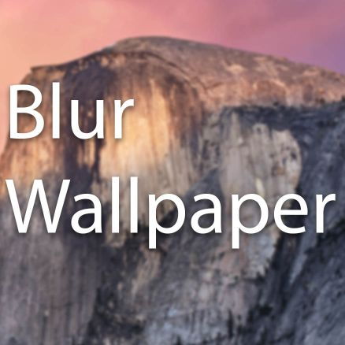

# MultiFilter-Wallpaper

  

<a href="http://store.steampowered.com/app/431960/Wallpaper_Engine/">Wallpaper Engine</a> theme that loads a single image or picks a random image from a directory and create a multi-filter wallpaper image, incluiding:

- Opacity
- Scale
- Blur
- Saturation
- Brightness
- Contrast
- Grayscale
- Invert
- Sepia
- Hue rotation angle

## Author
<a href="http://ppizarror.com">Pablo Pizarro R.</a> | 2017.